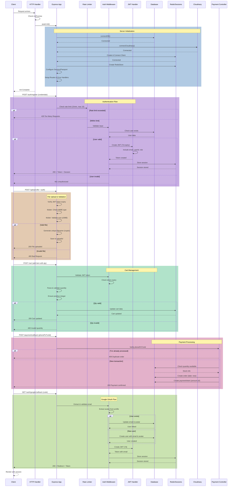

# Layerly - 3D Printing E-Commerce Platform

A full-stack e-commerce platform for 3D printed products with custom quote functionality, built with React, Node.js, Express, and MongoDB.

## Features

### Customer Features
- **Product Catalog**: Browse 3D printed products across multiple categories
  - Idols & Spirituality
  - Home & Office
  - Characters
  - Tools & Utilities
  - Gaming
- **3D Model Viewer**: Interactive Three.js-based STL file viewer for product previews
- **Multi-Color Options**: Products available in 5 colors (White, Black, Gray, Red, Orange)
- **Custom Quote Requests**: Upload STL files and request custom 3D printing quotes
- **User Authentication**: 
  - Email/Password authentication
  - Google OAuth integration
  - Email verification system
  - Password reset functionality
- **Shopping Cart**: Add products with color selection
- **Order Management**: Place orders and track order history
- **Secure Payments**: PhonePe payment gateway integration
- **User Profile**: Manage account information and view order history

### Admin Features
- **Product Management**: Add, update, and remove products with multi-image upload
- **Order Management**: View and manage customer orders
- **Custom Quote System**: Review custom quote requests and respond to customers
- **Admin Dashboard**: Comprehensive overview of store operations

### Technical Features
- **Responsive Design**: Tailwind CSS for mobile-first responsive UI
- **Session Management**: Redis-based session storage
- **File Uploads**: Cloudinary integration for image storage
- **Email Notifications**: Nodemailer for transactional emails
- **Rate Limiting**: Protection against API abuse
- **Security**: bcrypt password hashing, JWT authentication
- **PDF Generation**: PDFKit for invoices and documents

## Tech Stack

### Frontend
- **Framework**: React 19.1
- **Routing**: React Router DOM 7.6
- **Styling**: Tailwind CSS 4.1
- **Build Tool**: Vite 7.0
- **3D Graphics**: Three.js 0.180
- **HTTP Client**: Axios 1.11
- **Notifications**: React Toastify

### Backend
- **Runtime**: Node.js (≥18.0.0)
- **Framework**: Express 5.1
- **Database**: MongoDB with Mongoose 8.18
- **Session Store**: Redis 5.8 with connect-redis
- **Authentication**: 
  - Passport.js with Google OAuth2.0
  - JWT (jsonwebtoken)
- **File Upload**: Multer 2.0
- **Cloud Storage**: Cloudinary 2.7
- **Email**: Nodemailer 7.0
- **Payment**: PhonePe payment gateway integration
- **Security**: 
  - bcrypt 6.0 for password hashing
  - express-rate-limit for API protection
  - validator for input validation
- **PDF Generation**: PDFKit 0.17
- **ID Generation**: nanoid 5.1

### Admin Panel
- **Framework**: React 19.1
- **Routing**: React Router DOM 7.8
- **Styling**: Tailwind CSS 4.1
- **Build Tool**: Vite 7.1
- **3D Graphics**: Three.js 0.180

## Sequence Diagram




## Project Structure

```
layerly/
├── frontend/          # Customer-facing React application
│   ├── src/
│   │   ├── components/   # Reusable UI components
│   │   ├── context/      # React Context for state management
│   │   ├── pages/        # Page components
│   │   └── assets/       # Static assets
│   └── public/
├── admin/             # Admin panel React application
│   ├── src/
│   │   ├── components/   # Admin UI components
│   │   └── pages/        # Admin pages
│   └── public/
└── backend/           # Node.js/Express API server
    ├── config/        # Configuration files
    │   ├── cloudinary.js    # Cloudinary setup
    │   ├── email.js         # Email configuration
    │   ├── mongodb.js       # Database connection
    │   └── passport.js      # OAuth setup
    ├── controllers/   # Business logic
    │   ├── cartController.js
    │   ├── customController.js
    │   ├── orderController.js
    │   ├── paymentController.js
    │   ├── productController.js
    │   └── userController.js
    ├── middleware/    # Express middleware
    │   ├── adminAuth.js     # Admin authentication
    │   ├── multer.js        # File upload handling
    │   └── userAuth.js      # User authentication
    ├── models/        # Mongoose schemas
    │   ├── customQuoteModel.js
    │   ├── orderModel.js
    │   ├── paymentIntentModel.js
    │   ├── productModel.js
    │   └── userModel.js
    └── routes/        # API routes
        ├── cartRoutes.js
        ├── customRoutes.js
        ├── orderRoutes.js
        ├── paymentRoutes.js
        ├── productRoutes.js
        └── userRoutes.js
```

## Detailed File Structure and Functions

### Backend Files

#### Configuration Files (backend/config/)

| File | Purpose | Key Functions |
|------|---------|---------------|
| `cloudinary.js` | Cloudinary integration setup | Configures Cloudinary SDK for image upload and storage with API credentials |
| `email.js` | Email service configuration | Sets up Nodemailer transporter, includes functions for sending verification emails, password reset emails, welcome emails, and custom quote reply emails |
| `mongodb.js` | Database connection | Establishes and maintains MongoDB connection using Mongoose with error handling and connection pooling |
| `passport.js` | OAuth authentication | Configures Passport.js with Google OAuth2.0 strategy, handles user authentication flow, creates/updates user records on OAuth login |

#### Controllers (backend/controllers/)

| File | Purpose | Key Functions |
|------|---------|---------------|
| `userController.js` | User management | `registerUser()` - Creates new user accounts with email verification<br>`verifyEmail()` - Verifies user email addresses<br>`loginUser()` - Authenticates users with email/password<br>`googleAuth()` - Handles Google OAuth callbacks<br>`getUserProfile()` - Retrieves user profile data<br>`updateProfile()` - Updates user information<br>`requestPasswordReset()` - Initiates password reset flow<br>`resetPassword()` - Completes password reset |
| `productController.js` | Product operations | `addProduct()` - Creates new products with multi-color images<br>`updateProduct()` - Modifies existing product details<br>`listProduct()` - Retrieves all products from database<br>`singleProduct()` - Fetches single product by ID<br>`removeProduct()` - Deletes products from catalog |
| `cartController.js` | Shopping cart | `addToCart()` - Adds items with color/quantity to user cart<br>`updateCart()` - Updates item quantities in cart<br>`getUserCart()` - Retrieves user's cart data<br>`removeFromCart()` - Removes items from cart |
| `orderController.js` | Order processing | `allOrders()` - Admin retrieval of all orders<br>`userOrders()` - Fetches orders for specific user<br>`updateStatus()` - Admin updates order status<br>`placeOrder()` - Creates new order from cart<br>`generateInvoice()` - Generates PDF invoices using PDFKit |
| `paymentController.js` | Payment handling | `initiatePhonePe()` - Creates PhonePe payment intent<br>`verifyPayment()` - Confirms payment completion and status<br>`handleCallback()` - Processes PhonePe payment callbacks<br>`getPhonePeToken()` - Retrieves OAuth access token for PhonePe API |
| `customController.js` | Custom quotes | `createCustomQuote()` - Submits custom 3D printing quote requests<br>`listCustomQuotes()` - Admin retrieves all quote requests<br>`replyToCustomQuote()` - Admin responds to customer quotes<br>`closeCustomQuote()` - Marks quote as closed<br>`proxyStl()` - Proxies STL file requests for security |

#### Middleware (backend/middleware/)

| File | Purpose | Key Functions |
|------|---------|---------------|
| `adminAuth.js` | Admin authentication | Verifies admin JWT tokens, checks admin credentials, protects admin-only routes from unauthorized access |
| `userAuth.js` | User authentication | Validates user JWT tokens, extracts user ID from tokens, protects user-specific routes |
| `multer.js` | File upload handling | Configures Multer for handling multi-part form data, manages temporary file storage before Cloudinary upload |

#### Models (backend/models/)

| File | Purpose | Schema Definition |
|------|---------|-------------------|
| `userModel.js` | User data schema | Fields: name, email, password (hashed), avatar, cartData, googleId, isEmailVerified, emailVerificationToken, emailVerificationExpires, passwordResetToken, passwordResetExpires, createdAt, updatedAt |
| `productModel.js` | Product data schema | Fields: productID (unique), name, description, price, imagesByColor (Map), availableColors (array), category (enum), date, bestseller (boolean), timestamps |
| `orderModel.js` | Order data schema | Fields: userID, items (array with productId, color, quantity, price), amount, address (object with street, city, state, zip, country, phone), status (enum: Order Placed, Packing, Shipped, Out for Delivery, Delivered), paymentMethod, payment (boolean), date |
| `customQuoteModel.js` | Custom quote schema | Fields: userID (optional), name, email, phone, material, layerHeight, infill, infillPattern, supports, brim, raft, color, instructions, fileUrl (Google Drive link), status (PENDING, REPLIED, CLOSED), adminReply, createdAt, updatedAt |
| `paymentIntentModel.js` | Payment tracking | Fields: userID, orderId, paymentIntentId, amount, currency, status (pending, succeeded, failed), provider (stripe/phonepe), metadata, createdAt, updatedAt |

#### Routes (backend/routes/)

| File | Purpose | Endpoints Defined |
|------|---------|-------------------|
| `userRoutes.js` | User API routes | POST /register, /login, /verify-email, /reset-password, /forgot-password<br>GET /profile, /google, /google/callback<br>PUT /profile |
| `productRoutes.js` | Product API routes | GET /list, /:id<br>POST /add (admin)<br>PUT /update/:id (admin)<br>DELETE /remove/:id (admin) |
| `cartRoutes.js` | Cart API routes | GET / (get cart)<br>POST /add<br>PUT /update<br>DELETE /remove |
| `orderRoutes.js` | Order API routes | GET /list (admin), /user<br>POST /place<br>PUT /status (admin)<br>GET /invoice/:orderId |
| `customRoutes.js` | Custom quote routes | POST /quote<br>GET /quotes (admin), /proxy-stl<br>POST /quote/:id/reply (admin), /quote/:id/close (admin) |
| `paymentRoutes.js` | Payment routes | POST /create-intent, /verify, /stripe-webhook<br>GET /status/:paymentId |

#### Root Files (backend/)

| File | Purpose | Description |
|------|---------|-------------|
| `server.js` | Application entry point | Initializes Express server, configures middleware (CORS, sessions, Redis), connects databases, defines all route handlers, manages session storage with connect-redis, implements rate limiting, starts HTTP server |
| `package.json` | Dependencies & scripts | Lists all npm packages, defines start/build scripts, specifies Node.js version requirements (≥18.0.0) |
| `vercel.json` | Vercel deployment config | Configures serverless function deployment, defines routes, sets build settings for Vercel platform |
| `render.yaml` | Legacy deployment config | Previously used for Render.com (no longer active) |

### Frontend Files

#### Components (frontend/src/components/)

| File | Purpose | Functionality |
|------|---------|---------------|
| `Navbar.jsx` | Navigation bar | Displays logo, navigation links, search icon, user profile dropdown, cart icon with item count, handles responsive mobile menu |
| `Footer.jsx` | Site footer | Shows company information, links to legal pages, social media icons, newsletter subscription |
| `Hero.jsx` | Landing hero section | Displays main banner with hero image, call-to-action buttons, promotional messaging |
| `Bestseller.jsx` | Featured products | Showcases bestselling products in grid layout, filters products where bestseller=true |
| `NewLaunch.jsx` | Latest products | Displays recently added products sorted by date, shows newest items |
| `ProductItems.jsx` | Product card component | Reusable component displaying product image, name, price, color options, "Add to Cart" functionality |
| `SearchBar.jsx` | Search functionality | Provides product search input, filters products by name/description, shows search results |
| `StlCanvas.jsx` | 3D model viewer | Renders STL files using Three.js, provides interactive 3D preview with rotation/zoom, configurable colors and lighting |
| `Policy.jsx` | Policy highlights | Displays key policies (shipping, returns, support) in icon-based cards |
| `Pagestats.jsx` | Statistics display | Shows key metrics like total products, happy customers, delivery statistics |

#### Pages (frontend/src/pages/)

| File | Purpose | Functionality |
|------|---------|---------------|
| `Home.jsx` | Landing page | Combines Hero, NewLaunch, Bestseller, Pagestats components for homepage |
| `Catalogue.jsx` | Product listing | Displays all products with category filters, search integration, pagination |
| `Product.jsx` | Product details | Shows single product details, color selection, quantity picker, add to cart, 3D preview if available |
| `Custom.jsx` | Custom quote form | Form for submitting custom 3D print requests with STL upload, material/settings selection |
| `Cart.jsx` | Shopping cart | Lists cart items, quantity adjustment, color display, total calculation, proceed to checkout |
| `PlaceOrder.jsx` | Checkout page | Shipping address form, order summary, payment method selection, PhonePe payment gateway integration |
| `Orders.jsx` | Order history | Displays user's past orders, order status tracking, invoice download links |
| `Profile.jsx` | User profile | Shows/edits user information, avatar upload, email verification status, password change |
| `Login.jsx` | Authentication | Login/register forms, email/password authentication, Google OAuth button, form validation |
| `About.jsx` | About company | Company information, mission statement, team details |
| `VerifyEmail.jsx` | Email verification | Handles email verification token from URL, confirms email address |
| `ResetPassword.jsx` | Password reset | Password reset form with token validation, new password submission |
| `PrivacyPolicy.jsx` | Privacy policy | Legal document explaining data handling practices |
| `TAC.jsx` | Terms and conditions | Legal terms of service document |
| `Returns.jsx` | Return policy | Details about product returns and refunds |
| `Shipping.jsx` | Shipping policy | Shipping methods, costs, delivery timeframes |
| `Cancellation.jsx` | Cancellation policy | Order cancellation rules and procedures |
| `AuthSuccess.jsx` | OAuth callback | Handles successful Google OAuth redirect, stores token |

#### Context (frontend/src/context/)

| File | Purpose | Functionality |
|------|---------|---------------|
| `ShopContext.jsx` | Global state management | Manages products state, cart state, user authentication state, provides functions for cart operations, fetches products from API, handles token storage, shares currency and delivery fee across components |

#### Root Files (frontend/)

| File | Purpose | Description |
|------|---------|-------------|
| `App.jsx` | Root component | Defines React Router routes, wraps app in ShopContext provider, handles navigation structure |
| `main.jsx` | Application entry | Renders App component to DOM, imports global CSS, wraps in React.StrictMode |
| `index.css` | Global styles | Tailwind CSS imports, custom CSS variables, global styling rules |
| `vite.config.js` | Build configuration | Configures Vite bundler, React plugin, dev server settings |
| `package.json` | Dependencies & scripts | Lists React packages, build tools, defines dev/build/preview scripts |
| `vercel.json` | Vercel deployment config | SPA routing configuration for Vercel deployment |

### Admin Panel Files

#### Components (admin/src/components/)

| File | Purpose | Functionality |
|------|---------|---------------|
| `Navbar.jsx` | Admin navigation | Displays admin panel header, logout button, user info |
| `Sidebar.jsx` | Admin sidebar menu | Navigation links to Add, List, Orders, Quotes pages |
| `Login.jsx` | Admin login | Authenticates admin users with email/password |
| `StlCanvas.jsx` | 3D preview | Same Three.js STL viewer as frontend for product preview |

#### Pages (admin/src/pages/)

| File | Purpose | Functionality |
|------|---------|---------------|
| `Add.jsx` | Add products | Form for creating new products with multi-color image uploads, product details input, Cloudinary integration, real-time image preview |
| `List.jsx` | Product management | Displays all products in table/grid, edit/delete functionality, product search/filter |
| `Orders.jsx` | Order management | Shows all orders from customers, status update dropdown, order details view, filtering by status |
| `Quotes.jsx` | Quote management | Lists custom quote requests, displays STL files via proxy, reply interface, quote status management |

#### Root Files (admin/)

| File | Purpose | Description |
|------|---------|-------------|
| `App.jsx` | Admin root component | Defines admin routes, authentication check, renders Navbar/Sidebar |
| `main.jsx` | Application entry | Renders admin App to DOM |
| `index.css` | Global styles | Tailwind imports, admin-specific styling |
| `vite.config.js` | Build configuration | Vite configuration for admin panel |
| `package.json` | Dependencies & scripts | Admin panel dependencies and scripts |
| `vercel.json` | Vercel deployment config | Admin panel Vercel deployment settings |

### API Test Files

| File | Purpose | Description |
|------|---------|-------------|
| `apitest.http` | General API testing | Contains HTTP requests for testing user, product, cart, order endpoints |
| `apiupdate.http` | Update operation tests | Specific tests for PUT/PATCH operations on various resources |

## API Endpoints

### User Routes
- `POST /api/user/register` - Register new user
- `POST /api/user/login` - User login
- `GET /api/user/google` - Google OAuth login
- `POST /api/user/verify-email` - Verify email address
- `POST /api/user/reset-password` - Request password reset
- `GET /api/user/profile` - Get user profile

### Product Routes
- `GET /api/product/list` - Get all products
- `GET /api/product/:id` - Get single product
- `POST /api/product/add` - Add product (admin)
- `PUT /api/product/update/:id` - Update product (admin)
- `DELETE /api/product/remove/:id` - Remove product (admin)

### Cart Routes
- `GET /api/cart` - Get user cart
- `POST /api/cart/add` - Add item to cart
- `PUT /api/cart/update` - Update cart item
- `DELETE /api/cart/remove` - Remove item from cart

### Order Routes
- `POST /api/order/place` - Place new order
- `GET /api/order/user` - Get user orders
- `GET /api/order/list` - Get all orders (admin)
- `PUT /api/order/status` - Update order status (admin)

### Custom Quote Routes
- `POST /api/custom/quote` - Submit custom quote request
- `GET /api/custom/quotes` - Get all quotes (admin)
- `POST /api/custom/quote/:id/reply` - Reply to quote (admin)
- `POST /api/custom/quote/:id/close` - Close quote (admin)
- `GET /api/custom/proxy-stl` - Proxy STL file requests

### Payment Routes
- `POST /api/payment/create-intent` - Create PhonePe payment intent
- `POST /api/payment/callback` - Handle PhonePe payment callback
- `GET /api/payment/status/:paymentId` - Check payment status

## Security Features

- **Password Hashing**: bcrypt with salt rounds
- **JWT Authentication**: Secure token-based authentication
- **Session Management**: Redis-backed secure sessions
- **Rate Limiting**: Protection against brute force attacks
- **Input Validation**: Validator library for sanitizing inputs
- **CORS Configuration**: Controlled cross-origin resource sharing
- **Environment Variables**: Sensitive data stored securely
- **Admin Authentication**: Separate authentication for admin routes

## Key Components

### Frontend Components
- **StlCanvas**: Three.js-based 3D model viewer for STL files
- **Navbar**: Navigation with cart and user menu
- **ProductItems**: Reusable product card component
- **SearchBar**: Product search functionality
- **Hero**: Landing page hero section
- **Bestseller**: Featured bestseller products
- **Footer**: Site footer with links

### Admin Components
- **Sidebar**: Admin navigation
- **StlCanvas**: 3D model preview for products
- **Navbar**: Admin navigation bar


## Available Pages

### Customer Pages
- Home - Landing page with featured products
- Catalogue - Full product catalog with filtering
- Product - Individual product details
- Custom - Custom quote request form
- Cart - Shopping cart
- PlaceOrder - Checkout page
- Orders - Order history
- Profile - User profile management
- Login - Authentication page
- About - About the company
- VerifyEmail - Email verification
- ResetPassword - Password reset
- PrivacyPolicy, TAC, Returns, Shipping, Cancellation - Legal pages

### Admin Pages
- Add - Add new products
- List - Product list management
- Orders - Order management
- Quotes - Custom quote management


